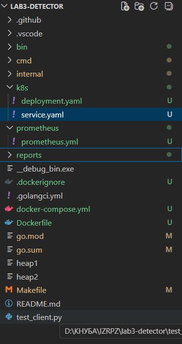
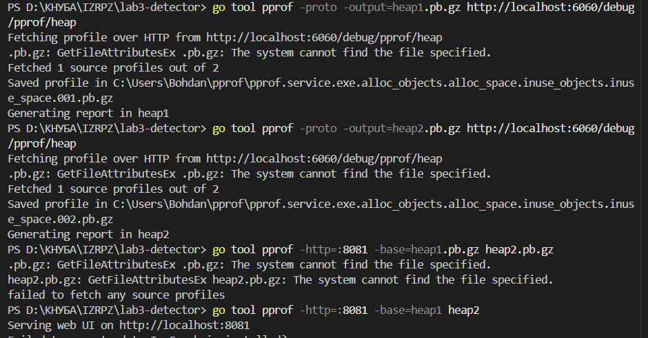
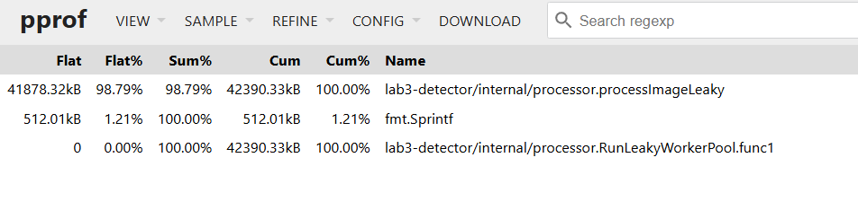
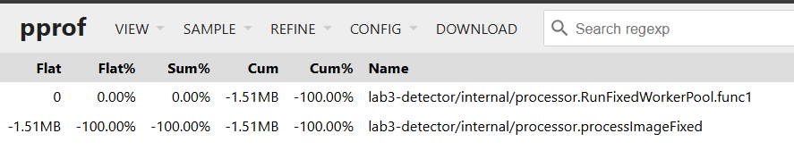
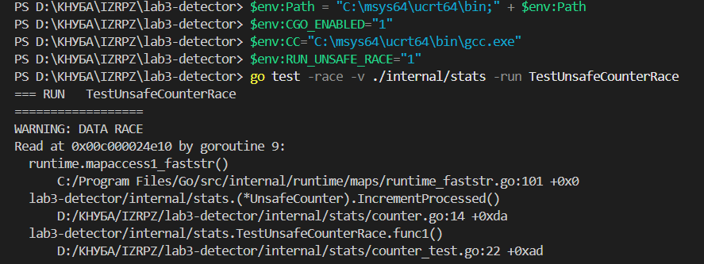
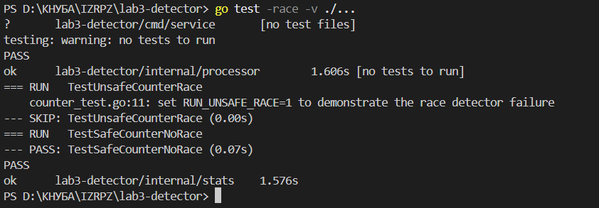
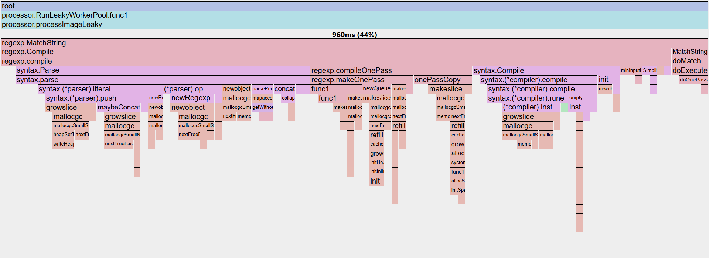
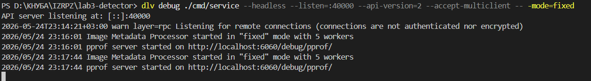
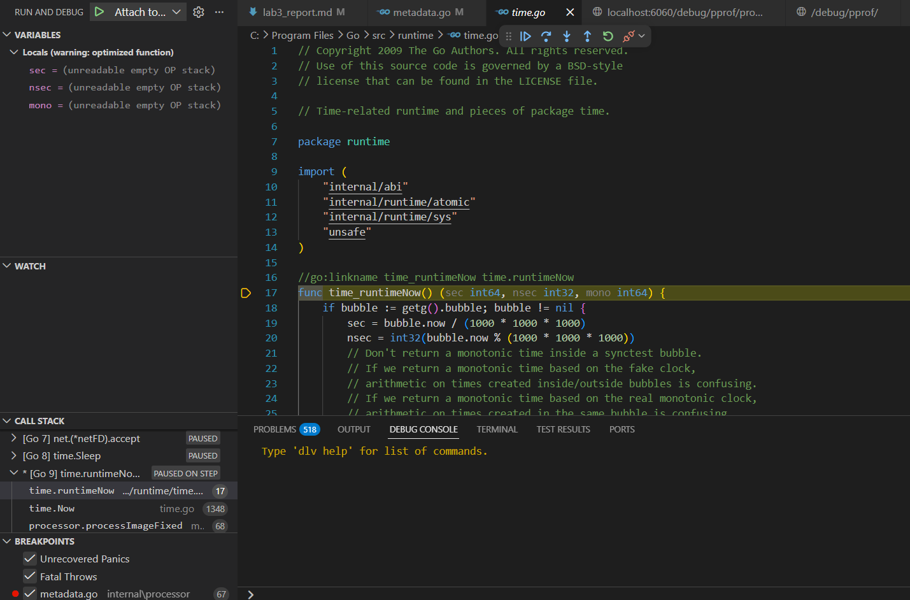

# Звіт до лабораторної роботи №3

**Дисципліна:** Інструментальні засоби розробки програмного забезпечення  
**Тема:** Діагностика та рефакторинг високопродуктивних систем у Go  
**Студент:** Бородій Богдан Сергійович
**Група:** іпз25

---

## 1. Мета роботи

Метою лабораторної роботи є набуття практичних навичок діагностики прихованих дефектів у Go-сервісах: витоків памʼяті, станів гонитви, взаємоблокувань та неефективних ділянок коду. Для цього використовуються інструменти `pprof`, `go test -race`, benchmark-тести, CPU profiling та віддалене налагодження через Delve.

---

## 2. Структура проєкту

У межах роботи було створено окремий репозиторій `lab3-detector` зі стандартною структурою Go-проєкту:

```text
lab3-detector/
├── cmd/service/main.go
├── internal/processor/metadata.go
├── internal/processor/metadata_test.go
├── internal/stats/counter.go
├── internal/stats/counter_test.go
├── reports/lab3_report.md
├── test_client.py
├── Makefile
└── go.mod
```

**Місце для скріншота 1:** вставити скріншот структури проєкту у VS Code.



---

## 3. Етап 1 — Виявлення витоку памʼяті за допомогою Heap Profiling

У файлі `cmd/service/main.go` було підключено пакет `net/http/pprof`, який відкриває службові endpoints для профілювання. Сервер `pprof` запускається на порту `6060`.

Команда запуску проблемної версії сервісу:

```bash
go run ./cmd/service -mode=leaky
```

Після запуску сервісу було знято перший heap-профіль:

```bash
go tool pprof -proto -output=heap1.pb.gz http://localhost:6060/debug/pprof/heap
```

Через приблизно 2 хвилини було знято другий heap-профіль:

```bash
go tool pprof -proto -output=heap2.pb.gz http://localhost:6060/debug/pprof/heap
```

Для порівняння профілів використовувалась команда:

```bash
go tool pprof -http=:8081 -base=heap1.pb.gz heap2.pb.gz
```

**Місце для скріншота 2:** вставити скріншот першого heap-профілю або команди створення `heap1.pb.gz`.



**Місце для скріншота 3:** вставити скріншот другого heap-профілю або команди створення `heap2.pb.gz`.


**Місце для скріншота 4:** вставити скріншот `pprof` з порівнянням через `-base`, де видно функцію `processImageLeaky`.



### Аналіз причини витоку

Причиною витоку памʼяті є глобальна мапа `LeakCache`, у яку постійно додаються нові елементи:

```go
LeakCache[key] = make([]byte, 1024*10)
```

Кожен оброблений кадр додає приблизно 10 KB даних. Оскільки старі записи не видаляються, мапа постійно зростає. Garbage Collector не може звільнити ці обʼєкти, тому що на них усе ще існують посилання з глобальної змінної `LeakCache`.

### Виправлення

У виправленій версії було додано обмежений кеш `fixedCache`, захищений `sync.Mutex`. Якщо кількість записів перевищує заданий ліміт, один зі старих елементів видаляється. Це не дозволяє кешу безконтрольно збільшуватися.

Команда запуску виправленої версії:

```bash
go run ./cmd/service -mode=fixed
```

**Місце для скріншота 5:** вставити скріншот запуску виправленої версії сервісу.



---

## 4. Етап 2 — Пошук race condition

Для демонстрації стану гонитви було створено два варіанти лічильника:

- `UnsafeCounter` — використовує `map[string]int` без синхронізації;
- `SafeCounter` — використовує `sync.RWMutex` для безпечного доступу до мапи.

Команда для демонстрації проблеми у PowerShell:

```powershell
$env:RUN_UNSAFE_RACE="1"
go test -race -v ./internal/stats -run TestUnsafeCounterRace
Remove-Item Env:RUN_UNSAFE_RACE
```

**Місце для скріншота 6:** вставити лог race detector до виправлення, де видно `WARNING: DATA RACE`.



### Аналіз проблеми

Стан гонитви виникає через одночасний запис у спільну мапу з багатьох goroutine:

```go
c.values[imageType]++
```

Операція інкременту не є атомарною. Вона складається з читання поточного значення, збільшення та запису нового значення. Якщо кілька goroutine виконують ці дії одночасно, результат може бути некоректним.

### Виправлення

У `SafeCounter` доступ до мапи захищено за допомогою `sync.RWMutex`:

```go
c.mu.Lock()
defer c.mu.Unlock()
c.values[imageType]++
```

Для перевірки виправлення використано команду:

```bash
go test -race -v ./...
```

**Місце для скріншота 7:** вставити успішний запуск `go test -race -v ./...` після виправлення.



---

## 5. Етап 3 — CPU Profiling та оптимізація гарячого шляху

У проблемній версії обробника використовується неефективна операція:

```go
regexp.MatchString(`^image_data_\d+_timestamp_\d+$`, data)
```

Ця функція компілює регулярний вираз при кожному виклику. У високонавантаженому циклі це створює зайві витрати CPU.

Для збору CPU-профілю використано команду:

```bash
go tool pprof -http=:8082 http://localhost:6060/debug/pprof/profile?seconds=30
```

**Місце для скріншота 8:** вставити скріншот CPU profile або flame graph, де видно витрати на regexp.



### Оптимізація

Регулярний вираз було винесено у змінну рівня пакета:

```go
var imageDataPattern = regexp.MustCompile(`^image_data_\d+_timestamp_\d+$`)
```

Після цього в гарячому циклі використовується вже скомпільований шаблон:

```go
matched := imageDataPattern.MatchString(data)
```

### Benchmark до і після оптимізації

Для порівняння було створено benchmark-тести:

```bash
go test -bench=. -benchmem ./internal/processor
```

**Місце для скріншота 9:** вставити результат benchmark-тестів, де видно різницю між `BenchmarkProcessImageSlow` та `BenchmarkProcessImageOptimized`.


### Висновок щодо продуктивності

Після оптимізації зменшилася кількість алокацій памʼяті та час виконання операції. Це пояснюється тим, що регулярний вираз більше не компілюється на кожній ітерації, а повторно використовується вже підготовлений обʼєкт `regexp.Regexp`.

---

## 6. Етап 4 — Remote Debug через Delve

Для віддаленого налагодження використано Delve. Встановлення Delve:

```bash
go install github.com/go-delve/delve/cmd/dlv@latest
```

Запуск сервісу в headless-режимі:

```bash
dlv debug ./cmd/service --headless --listen=:40000 --api-version=2 --accept-multiclient -- -mode=fixed
```

Після цього у VS Code було використано конфігурацію `.vscode/launch.json` для підключення до процесу на порту `40000`.

**Місце для скріншота 10:** вставити скріншот термінала із запущеним `dlv --headless`.



**Місце для скріншота 11:** вставити скріншот VS Code, підключеного до Delve debugger.



---

## 7. Аналітичний висновок

У ході лабораторної роботи було використано декілька інструментів діагностики, кожен із яких відповідає окремому класу проблем.

Для пошуку витоку памʼяті було використано `pprof`, оскільки він дозволяє аналізувати heap-профілі працюючого сервісу та порівнювати два знімки памʼяті. Саме порівняння через `-base` дає змогу побачити не просто загальне використання памʼяті, а приріст між двома моментами часу.

Для виявлення race condition було використано `go test -race`. Цей інструмент корисний тим, що показує конкретні місця конкурентного доступу до спільних даних. У цій роботі він дозволив виявити небезпечний доступ до `map[string]int` без синхронізації.

Для аналізу продуктивності було використано CPU profiling і benchmark-тести. CPU profile допоміг знайти гарячу ділянку коду, а benchmark-тести дали змогу кількісно порівняти продуктивність до та після оптимізації.

Для налагодження працюючого процесу було використано Delve у headless-режимі. Такий підхід корисний, коли сервіс працює у віддаленому середовищі або контейнері, а розробник підключається до нього зі своєї IDE.

Отже, використані інструменти дозволили послідовно виявити та виправити три типові проблеми високонавантажених Go-систем: витік памʼяті, race condition і неефективний гарячий шлях виконання.

---

## 8. Контрольні питання

### 1. Як профілювання впливає на продуктивність живого сервісу?

Профілювання створює додаткове навантаження на сервіс, оскільки runtime збирає діагностичну інформацію про памʼять, CPU, goroutine або блокування. У більшості випадків коротке профілювання допустиме, але тривале або надто часте збирання профілів може погіршити продуктивність. Деякі операції профілювання можуть також короткочасно впливати на роботу garbage collector та планувальника goroutine.

### 2. Чим відрізняються in-use та allocated у heap profile?

`in-use` показує памʼять, яка залишається зайнятою на момент зняття профілю. `allocated` показує загальний обсяг памʼяті, який був виділений за час роботи програми. Для пошуку витоків памʼяті зазвичай корисніше дивитися на `in-use`, тому що витік означає, що обʼєкти залишаються доступними і не звільняються garbage collector.

### 3. Як виявити goroutine leak?

Goroutine leak можна виявити через `pprof` endpoint `/debug/pprof/goroutine` або командою `go tool pprof`. Якщо кількість goroutine постійно зростає або багато goroutine зависли в одному й тому самому стані, це ознака витоку. Така проблема небезпечна, бо кожна goroutine споживає памʼять і ресурси планувальника.

### 4. Як читати flame graphs?

Flame graph показує стек викликів під час профілювання. Ширина блоку відповідає частці часу CPU або ресурсів, які припали на конкретну функцію та її дочірні виклики. Чим ширший блок, тим більше ресурсів споживає ця ділянка програми.

### 5. Як escape analysis повʼязаний із heap і stack?

Escape analysis визначає, чи може змінна залишитися на стеку, чи повинна бути перенесена в heap. Якщо змінна "escape" з області функції, наприклад повертається за вказівником або використовується після завершення функції, компілятор розміщує її в heap. Це важливо для продуктивності, оскільки heap-алокації створюють додаткове навантаження на garbage collector.

---

## 9. Висновок

У лабораторній роботі було створено сервіс `Image Metadata Processor`, який містив типові проблеми високонавантажених Go-додатків. За допомогою `pprof` було знайдено витік памʼяті, спричинений необмеженим зростанням глобальної мапи. За допомогою `go test -race` було виявлено стан гонитви під час конкурентного оновлення статистики. За допомогою CPU profiling і benchmark-тестів було знайдено та оптимізовано гарячий шлях, повʼязаний із повторною компіляцією регулярного виразу. Також було налаштовано віддалене налагодження через Delve у headless-режимі.

Результатом роботи став окремий Go-проєкт із діагностичними сценаріями, виправленими реалізаціями та звітом у форматі Markdown.
