# Лабораторна робота №4

**Тема:** Командна розробка: стратегії розгалуження, Code Review та захист релізу

**Репозиторій:** `https://github.com/bodyanich/lab3-detector`

**Студент:** Bohdan Borodii

---

## 1. Мета роботи

Метою лабораторної роботи є освоєння індустріальних практик командної розробки: налаштування захищеної `main`-гілки, використання короткоживучих feature-гілок у стилі Trunk-based Development, створення Pull Request, проведення Code Review, виправлення зауважень, вирішення конфлікту через `rebase` та фінальне злиття через `Squash and merge`.

---

## 2. Використане програмне забезпечення

- Git
- GitHub
- Go SDK 1.21+
- VS Code
- GitHub Actions
- Проєкт `lab3-detector` з лабораторної роботи №3

---

## 3. Початковий стан проєкту

Для виконання лабораторної роботи було використано сервіс `Image Metadata Processor`, створений у лабораторній роботі №3. У проєкті вже були реалізовані механізми профілювання, race detector, benchmark-тести та режим запуску сервісу.

---

## 4. Налаштування CI для репозиторію

Для того щоб у Pull Request автоматично перевірялись тести та лінтер, було додано GitHub Actions workflow у файл:

```text
.github/workflows/ci.yml
```

Workflow запускається при `push` та `pull_request` у гілку `main` і виконує:

1. checkout коду;
2. встановлення Go;
3. перевірку залежностей;
4. запуск `golangci-lint`;
5. запуск тестів із `-race`.

**Скріншот 2 — файл `ci.yml`**


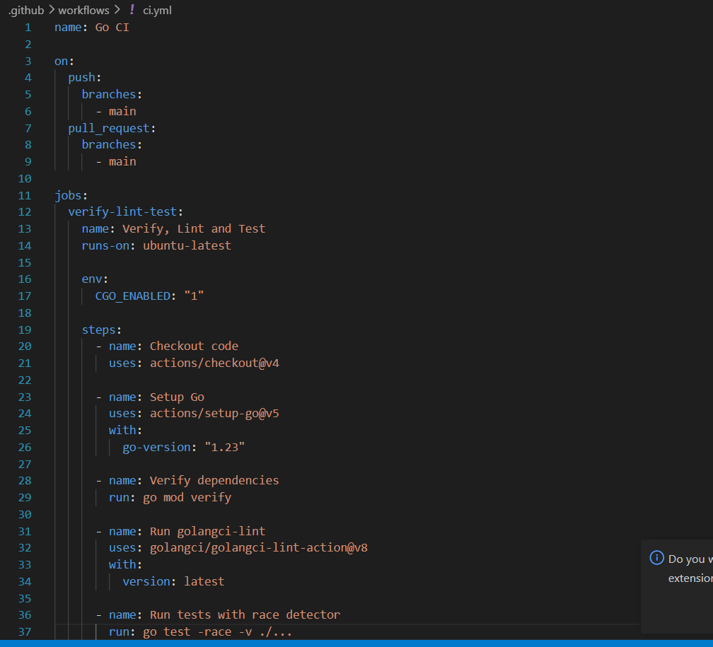

**Скріншот 3 — успішне проходження GitHub Actions**


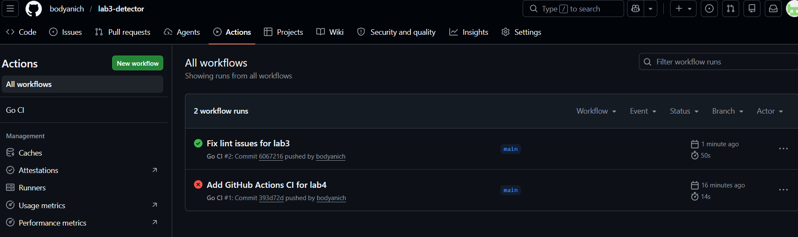

---

## 5. Налаштування Branch Protection

У GitHub було відкрито сторінку:

```text
Settings → Branches → Branch protection rules
```

Для гілки `main` було створено правило захисту з такими параметрами:

- `Require a pull request before merging`;
- `Require status checks to pass before merging`;
- обрано CI-check `Verify, Lint and Test`;
- `Require conversation resolution before merging`.

Це унеможливлює злиття змін у `main` без Pull Request, без успішного CI та без закриття обговорень.

**Скріншот 4 — налаштоване Branch Protection правило**


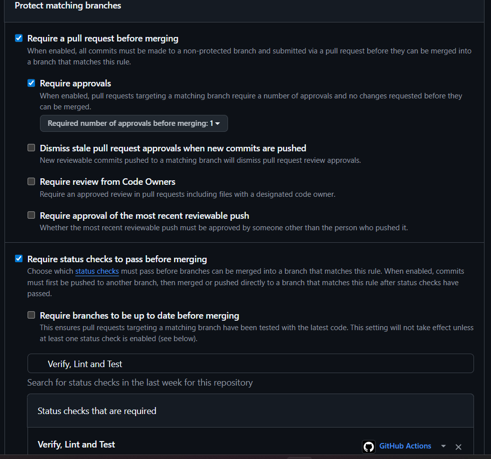

---

## 6. Додавання CODEOWNERS

Було створено файл:

```text
.github/CODEOWNERS
```

Вміст файлу:

```text
/internal/ @bodyanich
```

Це означає, що зміни у папці `internal/` мають відповідального власника коду.

---

## 7. Створення feature-гілки

Для реалізації зміни було створено короткоживучу гілку:

```bash
git checkout -b feat-improve-logging
```

Це відповідає підходу Trunk-based Development, де вся розробка виконується у коротких feature-гілках, які швидко інтегруються назад у `main`.

**Скріншот 6 — створення гілки `feat-improve-logging`**

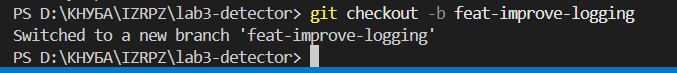

---

## 8. Реалізація структурованого логування

У проєкт було додано бібліотеку `zap`:

```bash
go get go.uber.org/zap
go mod tidy
```

Було створено пакет:

```text
internal/logging/
```

У сервісі було налаштовано глобальний структурований логер, а в обробнику зображень додано логування кількості оброблених зображень. Логування виконується у структурованому форматі: повідомлення містить поля `processed_count`, `worker_id` та `mode`.

**Скріншот 7 — код логера**

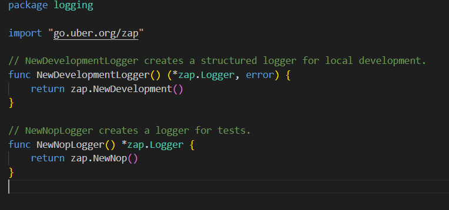

**Скріншот 8 — логування у processor**

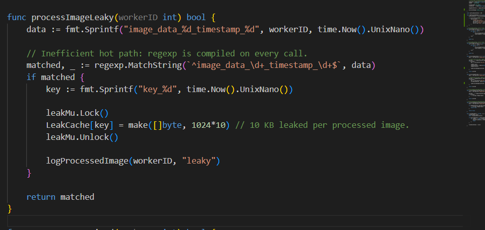

**Скріншот 9 — запуск сервісу з логами**

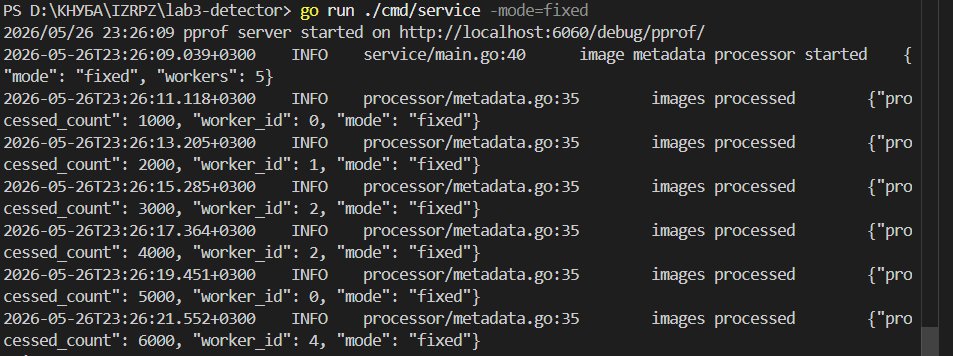

---

## 9. Unit-тест для логера

Після review-зауваження було додано unit-тест для нового пакета логування:

```bash
go test ./internal/logging -v
```

**Скріншот 10 — unit-тест логера**

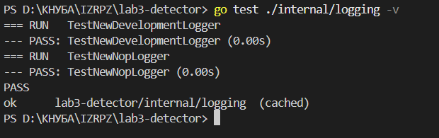

---

## 10. Pull Request

Після реалізації змін гілка була відправлена на GitHub:

```bash
git push -u origin feat-improve-logging
```

Після цього було створено Pull Request із назвою:

```text
Lab 4: Improve structured logging
```

У PR було описано зміни:

- додано `zap`;
- додано пакет `internal/logging`;
- додано структуроване логування кількості оброблених зображень;
- додано unit-тест для логера;
- оновлено `go.mod` і `go.sum`.

**Скріншот 11 — створений Pull Request**

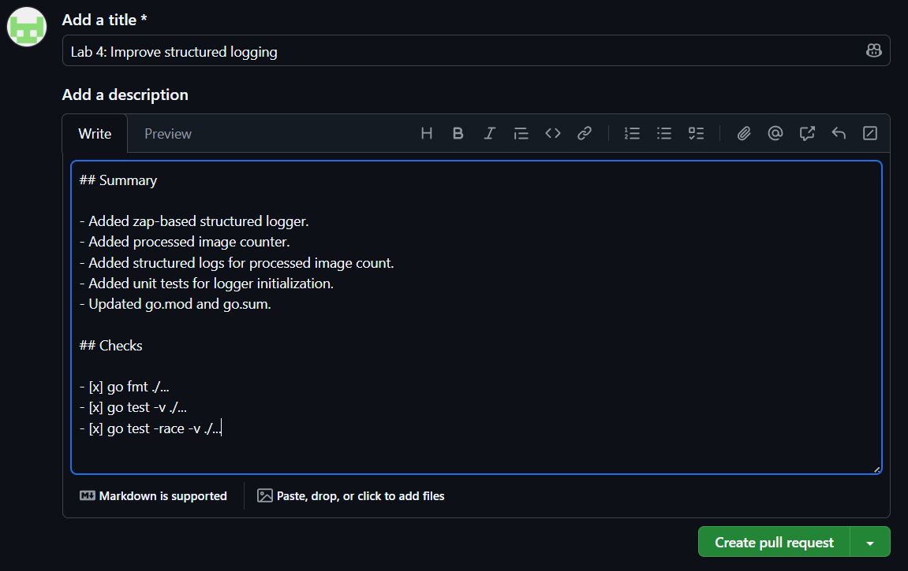

---

## 11. Code Review

У Pull Request було залишено три типи review-коментарів:

### 11.1 Suggestion

```text
suggestion: Consider renaming `processed` to `processedCount`, because the variable stores the total number of processed images, not a boolean state.
```

### 11.2 Question

```text
question: Why was zap chosen instead of the standard log package? Is structured logging required for future monitoring?
```

### 11.3 Nitpick

```text
nitpick: Please keep an empty line between logger initialization and business logic to improve readability.
```

Спочатку Pull Request отримав статус `Changes requested`, оскільки потрібно було додати unit-тест для нового логера. Після виправлення зауваження новим коммітом PR було перевірено повторно й затверджено.

**Скріншот 12 — review-коментарі**

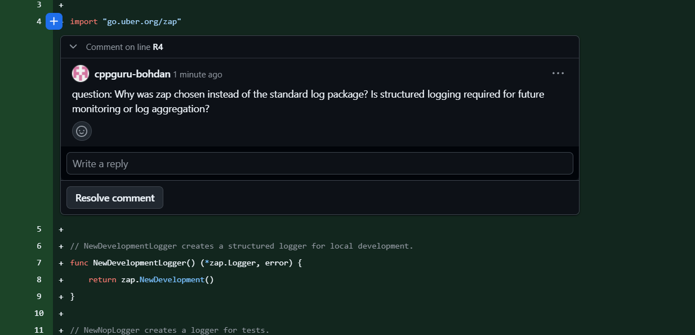

**Скріншот 13 — статус `Changes requested`**

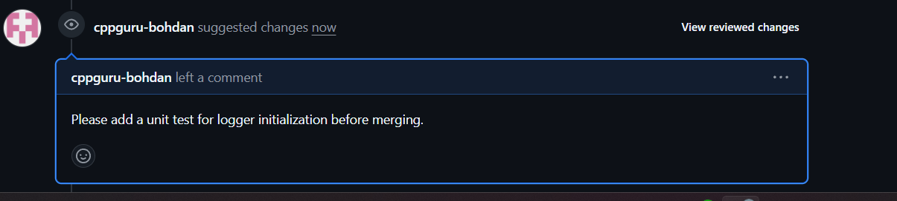

**Скріншот 14 — новий комміт із виправленням**

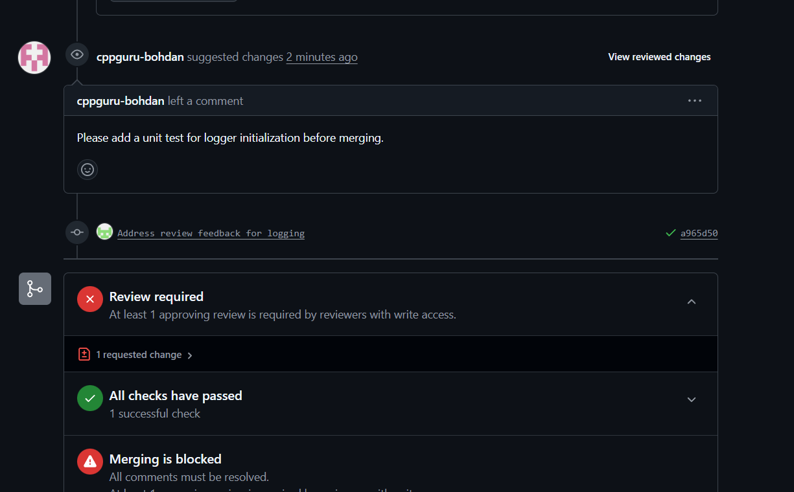

**Скріншот 15 — статус `Approved`**

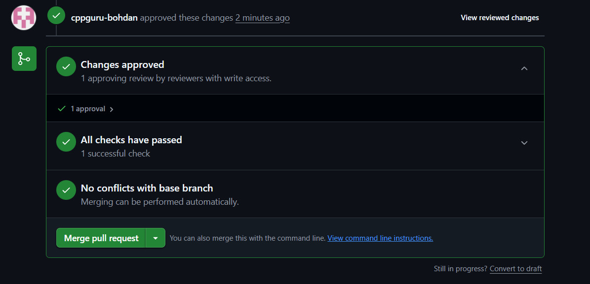

---

## 12. Створення та вирішення конфлікту

Для демонстрації conflict resolution у гілці `main` було змінено той самий файл, який змінювався у feature-гілці. Після цього у feature-гілці було виконано:

```bash
git fetch origin
git rebase origin/main
```

Після появи конфлікту файл було виправлено вручну, після чого виконано:

```bash
git add .
git rebase --continue
git push --force-with-lease
```

Для оновлення Pull Request після `rebase` було використано `--force-with-lease`, оскільки rebase змінює історію лише у власній feature-гілці.

**Скріншот 16 — конфлікт під час rebase**

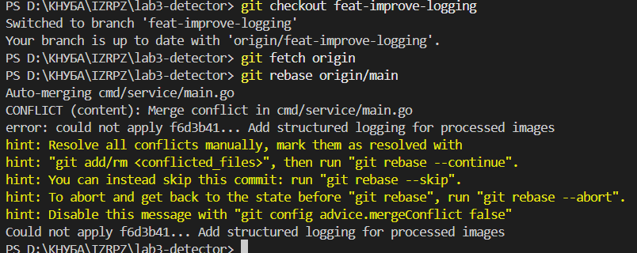

**Скріншот 17 — вирішення конфлікту**

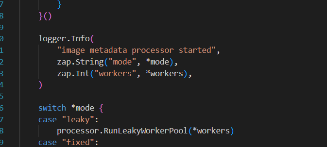

**Скріншот 18 — успішний rebase**

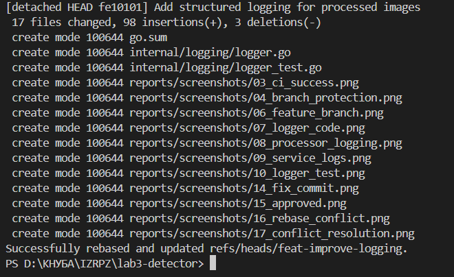

---

## 13. Final Merge

Після успішного проходження CI, закриття всіх conversation threads і отримання approval Pull Request було злито через:

```text
Squash and merge
```

Це дозволило зберегти чисту лінійну історію `main`: одна завершена фіча відповідає одному комміту в головній гілці.

**Скріншот 19 — зелений CI перед merge**

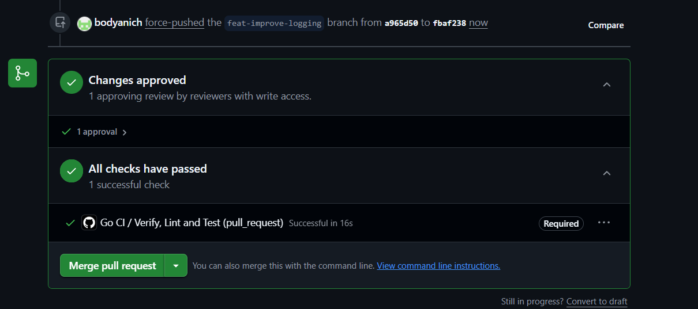

**Скріншот 20 — Squash and merge**

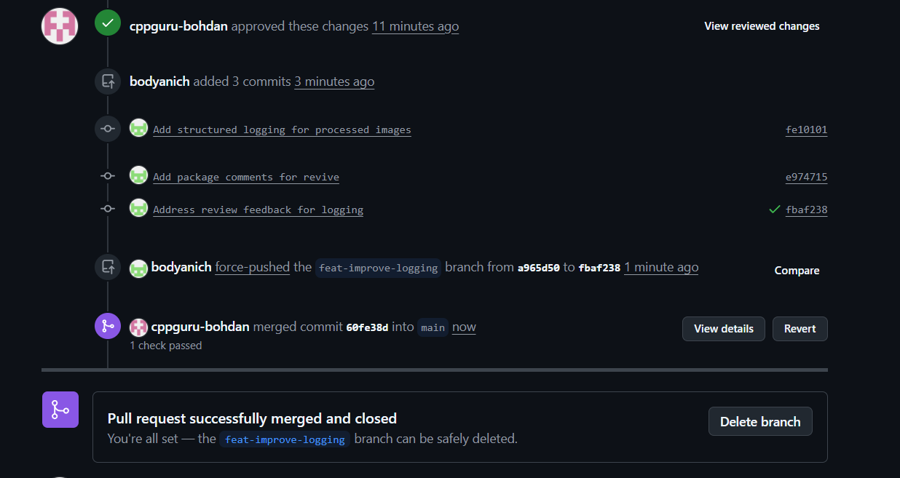

**Скріншот 21 — чиста історія main**

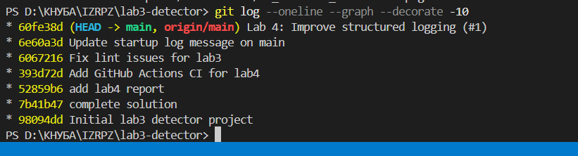

---

## 14. Висновок

У ході лабораторної роботи було налаштовано професійний процес командної розробки у GitHub. Було захищено гілку `main`, додано CODEOWNERS, реалізовано зміну в окремій короткоживучій гілці, створено Pull Request, проведено симуляцію Code Review з різними типами коментарів, виправлено зауваження новим коммітом, продемонстровано вирішення конфлікту через `rebase` і виконано фінальне злиття через `Squash and merge`.

Використання Branch Protection, CI, Pull Request та Code Review дозволяє зменшити ризик потрапляння помилкового коду в основну гілку. Підхід Trunk-based Development допомагає підтримувати короткий цикл інтеграції та зменшує кількість складних merge-конфліктів.

---

## 15. Контрольні питання

### 1. Чому Trunk-based Development вважається кращим для CI/CD, ніж класичний Git-flow?

Trunk-based Development краще підходить для CI/CD, тому що розробники працюють у короткоживучих гілках і швидко інтегрують зміни в `main`. Завдяки цьому CI часто перевіряє актуальний код, а ризик великих конфліктів зменшується. У Git-flow гілки можуть жити довго, тому інтеграція часто відкладається і стає складнішою.

### 2. Що таке Linear History і чому Squash Merge допомагає її підтримувати?

Linear History — це історія без зайвих merge-коммітів, де зміни йдуть послідовно одна за одною. `Squash and merge` об’єднує всі комміти feature-гілки в один комміт у `main`, тому історія залишається чистою і зрозумілою.

### 3. Чим небезпечний Force Push у спільну гілку і в яких випадках він допустимий?

Force Push небезпечний тим, що може переписати історію гілки й видалити чужі комміти. У спільних гілках, наприклад `main`, його не можна використовувати. Він допустимий у власній feature-гілці після `rebase`, але краще використовувати безпечніший варіант `git push --force-with-lease`.

### 4. Яка різниця між статусами Comment, Approve та Request Changes у процесі Code Review?

`Comment` означає, що reviewer залишив коментарі без блокування PR. `Approve` означає, що reviewer погоджується з внесеними змінами. `Request Changes` означає, що reviewer вимагає виправлень перед merge.

### 5. Як автоматизувати призначення рев’юерів у великих командах?

Для автоматизації можна використовувати файл `CODEOWNERS`, GitHub Teams, branch protection rules і налаштування required reviewers. У великих командах це дозволяє автоматично призначати відповідальних людей або команди для конкретних частин кодової бази.

---

## 16. Чек-лист перед здачею

- [ ] У репозиторії є Branch Protection rule для `main`.
- [ ] Merge у `main` без Pull Request заборонений.
- [ ] Увімкнені required status checks.
- [ ] Увімкнено conversation resolution before merging.
- [ ] Є файл `.github/CODEOWNERS`.
- [ ] Є Pull Request `feat-improve-logging`.
- [ ] У PR є review-коментарі: suggestion, question, nitpick.
- [ ] Спочатку був статус `Changes requested`.
- [ ] Зауваження виправлено новим коммітом.
- [ ] PR отримав approval.
- [ ] Конфлікт вирішено через `git rebase`.
- [ ] CI успішно пройшов.
- [ ] PR злито через `Squash and merge`.
- [ ] README містить CI badge.
