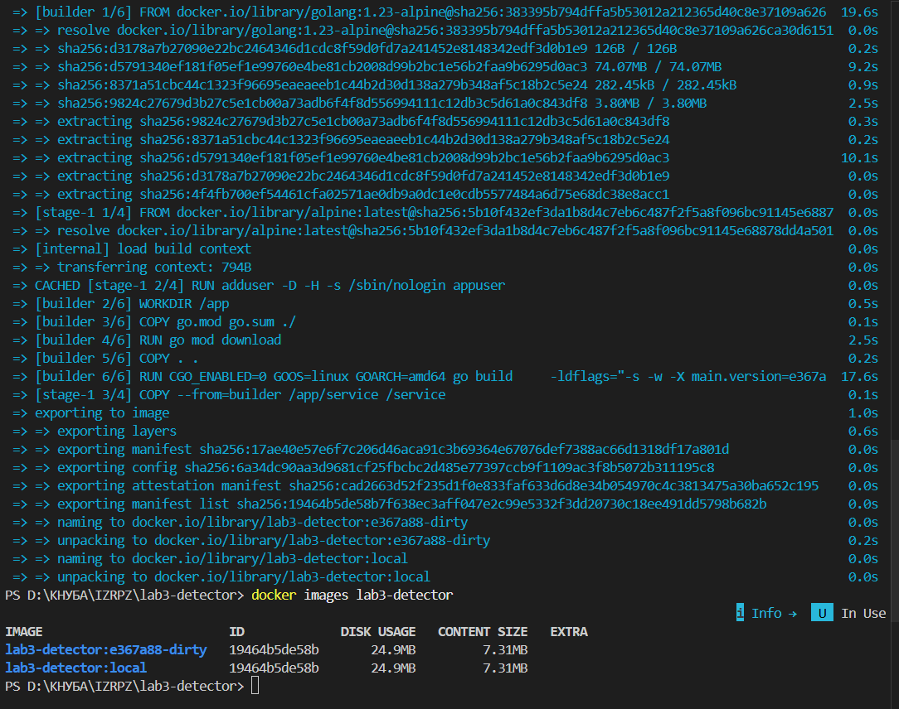
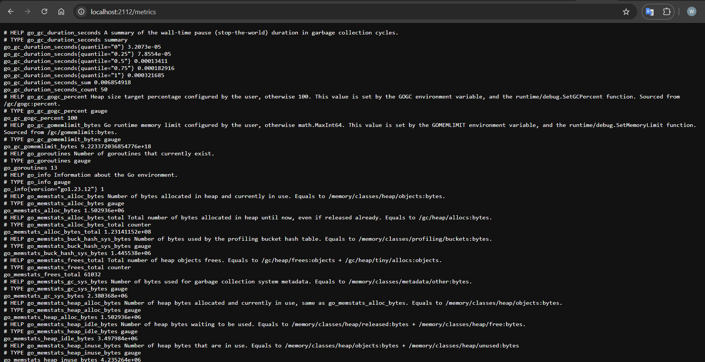
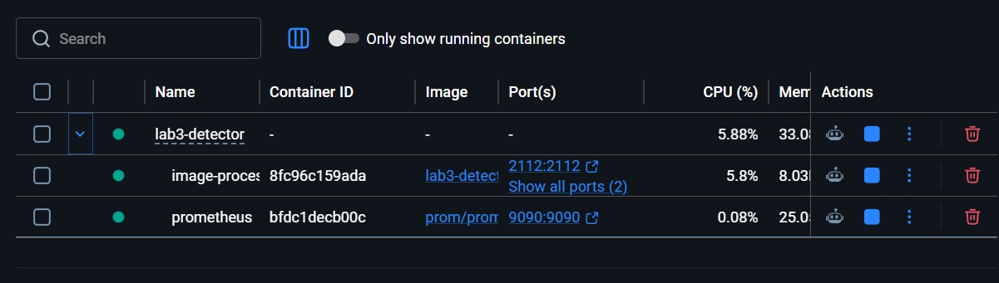
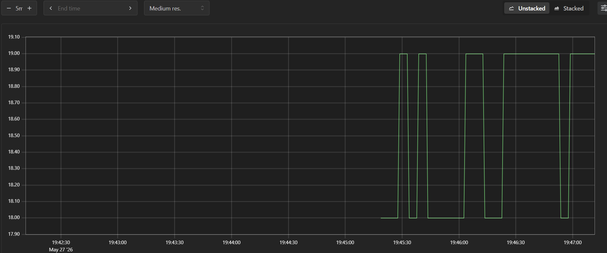

# Лабораторна робота №5

**Тема:** Контейнеризація, хмарна автоматизація та обсервабільність Go-застосунків

**Мета роботи:** навчитися створювати мінімальні Docker-образи для Go-сервісів, автоматизувати збірку через Makefile, налаштувати метрики Prometheus, підняти систему через Docker Compose та підготувати Kubernetes manifests.

---

## 1. Використане програмне забезпечення

- Go SDK 1.21+
- Docker Desktop
- Docker Compose
- Make
- Git
- Prometheus у Docker-контейнері
- Попередній проєкт `lab3-detector`

**Скріншот 1 — структура проєкту після додавання файлів лабораторної №5**


---

## 2. Multi-stage Dockerfile

Для контейнеризації сервісу було створено multi-stage `Dockerfile`.

Перший етап використовує образ `golang:1.21-alpine` для збірки Go-бінарника. На цьому етапі окремо копіюються `go.mod` і `go.sum`, після чого виконується `go mod download`. Це дозволяє ефективніше використовувати Docker layer caching.

Другий етап використовує легкий runtime-образ `alpine`. У фінальний образ копіюється тільки скомпільований бінарний файл. Застосунок запускається від імені окремого non-root користувача `appuser`.

Команда збірки:

```bash
make docker-build
```

Або напряму:

```bash
docker build -t lab3-detector:local .
```

**Скріншот 2 — успішна збірка Docker-образу**



---

## 3. Versioning через Makefile і LDFLAGS

У `Makefile` було додано змінну:

```makefile
VERSION=$(shell git describe --tags --always --dirty)
```

Під час збірки значення передається в Go-код через `-ldflags`:

```makefile
-ldflags "-X main.version=$(VERSION)"
```

Це дозволяє застосунку при запуску виводити свою версію, сформовану на основі Git-тега або короткого хешу коміту.

Команда локальної збірки:

```bash
make build
```

Перевірка запуску для Windows:

```powershell
.\bin\service.exe -mode=fixed
```

---

## 4. Observability: endpoint `/metrics`

До сервісу було додано Prometheus endpoint:

```text
http://localhost:2112/metrics
```

Для цього використано пакет:

```go
github.com/prometheus/client_golang/prometheus/promhttp
```

Endpoint експортує стандартні Go runtime-метрики, зокрема кількість goroutine, інформацію про пам’ять, GC та інші показники.

Перевірка у браузері:

```text
http://localhost:2112/metrics
```

**Скріншот 3 — endpoint `/metrics` у браузері**



---

## 5. Docker Compose і Prometheus

Було створено `docker-compose.yml`, який запускає два сервіси:

1. `image-processor` — Go-сервіс Image Metadata Processor.
2. `prometheus` — офіційний контейнер Prometheus.

Конфігурація Prometheus знаходиться у файлі:

```text
prometheus/prometheus.yml
```

Запуск системи:

```bash
docker compose up --build
```

Після запуску доступні адреси:

```text
Image Processor metrics: http://localhost:2112/metrics
Prometheus UI: http://localhost:9090
```

**Скріншот 4 — запущені контейнери Docker Compose**



---

## 6. Візуалізація метрик у Prometheus

У веб-інтерфейсі Prometheus було виконано запит:

```promql
go_goroutines
```

Ця метрика показує кількість активних goroutine у Go-сервісі.

**Скріншот 5 — графік `go_goroutines` у Prometheus**



---

## 7. Kubernetes manifests

Для статичного завдання було підготовлено мінімальні Kubernetes manifests:

```text
k8s/deployment.yaml
k8s/service.yaml
```

`deployment.yaml` описує запуск контейнера, resource requests/limits, readinessProbe та livenessProbe.

`service.yaml` створює сервіс типу `ClusterIP`, який відкриває порти застосунку і метрик усередині Kubernetes-кластера.

Перевірка синтаксису за наявності `kubectl`:

```bash
kubectl apply --dry-run=client -f k8s/
```

---

## 8. Висновок

У ході лабораторної роботи було контейнеризовано Go-сервіс Image Metadata Processor за допомогою multi-stage Dockerfile. У фінальний Docker-образ потрапляє лише скомпільований бінарний файл та мінімальне runtime-середовище, що зменшує розмір образу та площу атаки.

Через Makefile було реалізовано автоматизовану збірку з передаванням версії застосунку через `LDFLAGS`. Також було налаштовано observability через Prometheus. Сервіс експортує метрики на `/metrics`, а Prometheus збирає їх у pull-моделі. За допомогою Docker Compose вся система запускається однією командою.

Додатково було підготовлено Kubernetes manifests для майбутнього розгортання сервісу в кластері.

---

## 9. Контрольні питання

### 1. Чому важливо використовувати `CGO_ENABLED=0` при збірці образу на базі `scratch`?

`scratch` не містить системних бібліотек, shell, libc або інших runtime-компонентів. Якщо Go-бінарник залежить від cgo, йому можуть знадобитися зовнішні C-бібліотеки. `CGO_ENABLED=0` дозволяє зібрати статично лінкований Go-бінарник, який можна запускати в мінімальному контейнері без додаткових залежностей.

### 2. Яка перевага Multi-stage build порівняно з копіюванням всього SDK в образ?

Multi-stage build дозволяє використовувати великий build-образ тільки на етапі компіляції, а у фінальний runtime-образ копіювати лише готовий бінарний файл. Це зменшує розмір образу, пришвидшує доставку, знижує кількість зайвих файлів і покращує безпеку.

### 3. Що таке Liveness та Readiness probes в Kubernetes і навіщо вони Go-сервісу?

Liveness probe перевіряє, чи процес живий і не завис. Якщо перевірка не проходить, Kubernetes може перезапустити контейнер. Readiness probe перевіряє, чи сервіс готовий приймати трафік.

### 4. Чому в Dockerfile краще копіювати `go.mod` окремо від решти коду?

Це покращує Docker layer caching. Якщо `go.mod` і `go.sum` не змінюються, Docker може повторно використати шар із завантаженими залежностями.

### 5. Як Prometheus дізнається про те, що ваш сервіс з’явився?

Prometheus працює за pull-моделлю. Він сам періодично звертається до налаштованих targets і забирає метрики з endpoint `/metrics`.
