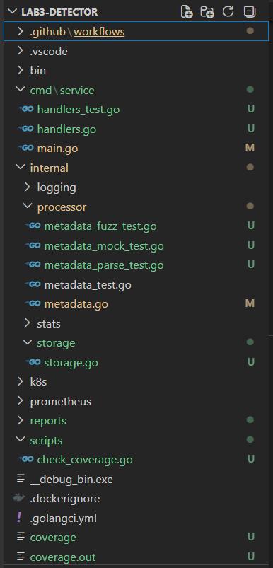
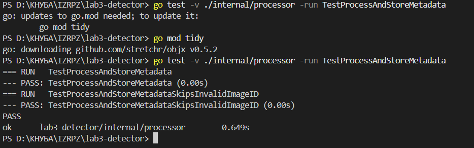
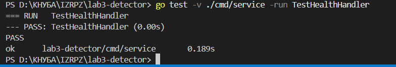
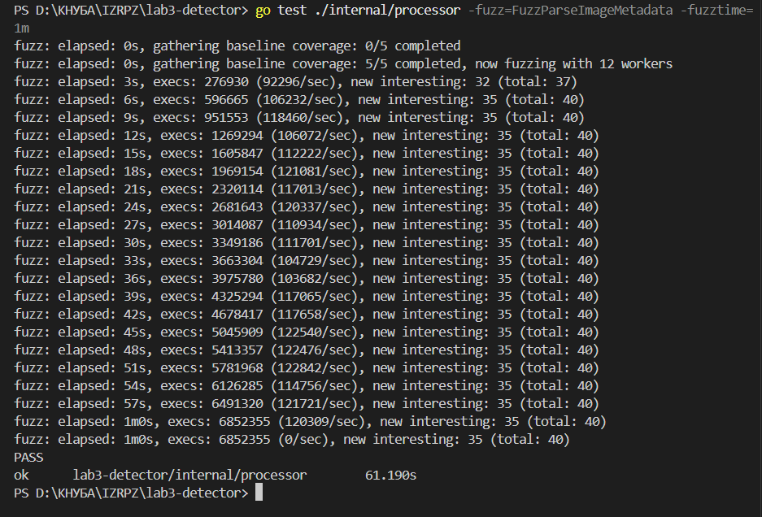
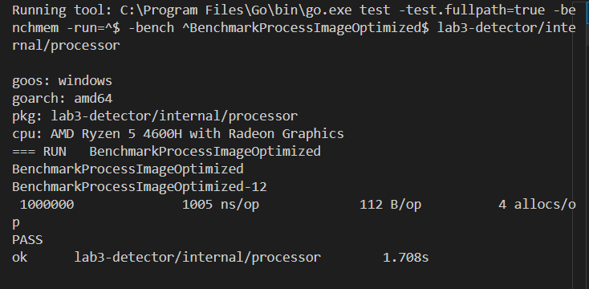
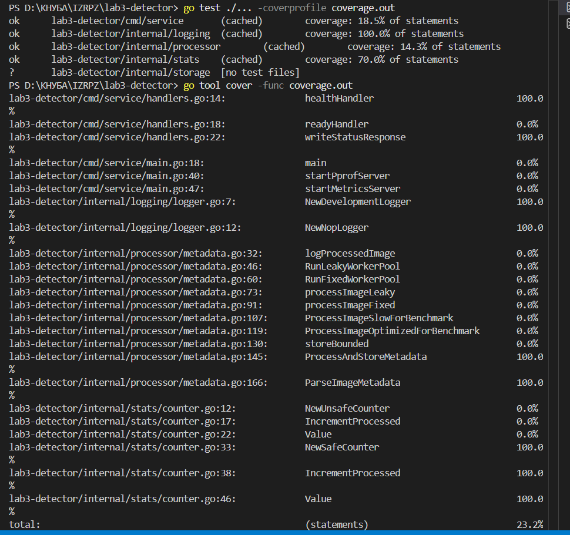

# Лабораторна робота №6

**Тема:** Глибоке тестування, фаззінг та автоматизація контролю якості в Go

**Мета роботи:** оволодіти просунутими техніками тестування в Go: використанням інтерфейсів для створення моків, тестуванням HTTP-запитів без запуску реального сервера, fuzz-тестуванням, benchmark-тестами та контролем покриття коду в CI.

---

## 1. Використане програмне забезпечення

- Go SDK 1.21+
- Visual Studio Code
- Git та GitHub
- Docker / Docker Compose
- GitHub Actions
- Бібліотека `stretchr/testify`
- Проєкт `Image Metadata Processor`

---

## 2. Структура проєкту

Після виконання лабораторної роботи структура проєкту містить додаткові пакети та тести:

```text
lab3-detector/
├── cmd/service/
│   ├── main.go
│   └── handlers.go
├── internal/processor/
│   ├── metadata.go
│   ├── metadata_test.go
│   └── metadata_fuzz_test.go
├── internal/storage/
│   ├── storage.go
│   └── storage_test.go
├── .github/workflows/ci.yml
├── Makefile
├── go.mod
├── go.sum
└── reports/lab6-report/
```

**Скріншот 1 — структура проєкту у VS Code**



---

## 3. Unit-тестування та Mocking

Для ізоляції логіки обробки зображень від зовнішнього збереження було створено інтерфейс `MetadataStore`. Це дозволяє передавати в процесор не реальну базу даних або файлове сховище, а mock-реалізацію.

У тестах використано пакет `testify/mock`, який дозволяє перевірити, чи був викликаний потрібний метод збереження.

Основні дії:

```bash
go get github.com/stretchr/testify@latest
go mod tidy
go test -v ./internal/processor -run TestProcessAndStoreMetadata
```

**Скріншот 2 — успішний запуск mock-тесту**



---

## 4. Тестування HTTP API через httptest

Для тестування HTTP-ендпоінта `/healthz` було використано `httptest.NewRecorder`. Це дозволяє перевірити handler без запуску реального HTTP-сервера.

Тест перевіряє:

- HTTP-статус `200 OK`;
- валідність JSON-відповіді;
- значення поля `status`.

Команда запуску:

```bash
go test -v ./cmd/service -run TestHealthHandler
```

**Скріншот 3 — успішний httptest**



---

## 5. Fuzz Testing

Для пошуку прихованих помилок було створено fuzz-тест для функції парсингу метаданих. Fuzzing передає у функцію різні випадкові рядки та перевіряє, що функція не викликає panic і коректно обробляє некоректний формат даних.

Команда запуску fuzz-тесту:

```bash
go test ./internal/processor -fuzz=FuzzParseImageMetadata -fuzztime=1m
```

Для швидкої перевірки без повноцінного fuzz-запуску:

```bash
go test -v ./internal/processor -run FuzzParseImageMetadata
```

**Скріншот 4 — запуск fuzz-тесту**



---

## 6. Benchmarking

Для порівняння продуктивності було використано benchmark-и для двох версій функції обробки:

- повільна версія, де регулярний вираз компілюється при кожному виклику;
- оптимізована версія, де регулярний вираз компілюється один раз.

Команда запуску:

```bash
go test ./internal/processor -run=^$ -bench=. -benchmem -count=1
```

У результатах аналізуються:

- `ns/op` — час виконання однієї операції;
- `B/op` — кількість байтів, виділених на одну операцію;
- `allocs/op` — кількість алокацій на одну операцію.

**Скріншот 5 — benchmark-результати**



---

## 7. Контроль покриття коду

Для перевірки test coverage було використано команду:

```bash
go test -coverprofile=coverage.out ./...
go tool cover -func=coverage.out
```

У CI було додано quality gate, який перевіряє, що загальне покриття не нижче 60%.

total: (statements) 23.2%

В проєкті є багато функцій, які складно покривати unit-тестами, наприклад:

main
startPprofServer
startMetricsServer
RunLeakyWorkerPool
RunFixedWorkerPool

Вони запускають сервери або нескінченні worker pools, тому для них нормально мати 0.0% у простому unit coverage.

**Скріншот 6 — coverage у GitHub Actions або локально**



---

## 8. Висновок

У ході лабораторної роботи було реалізовано набір просунутих технік тестування Go-застосунку. Використання інтерфейсів дозволило ізолювати бізнес-логіку від зовнішніх залежностей і перевірити її через mock-об’єкти. Пакет `httptest` дав змогу протестувати HTTP-handler без запуску реального сервера. Fuzz-тестування допомагає перевіряти стійкість функцій до випадкових або некоректних вхідних даних. Benchmark-и дозволили порівняти продуктивність різних реалізацій, а coverage profile у CI забезпечує автоматичний контроль якості коду.

---

## 9. Контрольні питання

### 1. Чому важливо використовувати інтерфейси для тестування?

Інтерфейси дозволяють реалізувати Dependency Injection. Завдяки цьому бізнес-логіка не залежить напряму від бази даних, API або файлової системи. У тестах замість реального зовнішнього сервісу можна передати mock або fake-реалізацію.

### 2. Чим Fuzz-тести відрізняються від Table-driven тестів?

Table-driven тести перевіряють заздалегідь визначені вхідні дані. Fuzz-тести генерують багато випадкових або змінених вхідних даних, щоб знайти неочевидні помилки, panic або некоректну обробку неочікуваного формату.

### 3. Яка роль httptest.ResponseRecorder?

`httptest.ResponseRecorder` записує відповідь HTTP-handler-а під час тесту. Він дозволяє перевірити статус-код, заголовки та тіло відповіді без запуску справжнього HTTP-сервера.

### 4. Що означають ns/op та B/op у benchmark?

`ns/op` показує, скільки наносекунд у середньому займає одна операція. `B/op` показує, скільки байтів пам’яті виділяється на одну операцію. Чим менші ці значення, тим ефективніша реалізація.

### 5. Чому 100% test coverage не гарантує відсутність багів?

100% coverage означає лише те, що всі рядки коду були виконані тестами. Це не гарантує, що перевірено всі можливі сценарії, граничні випадки, конкурентні помилки або неправильну бізнес-логіку.
